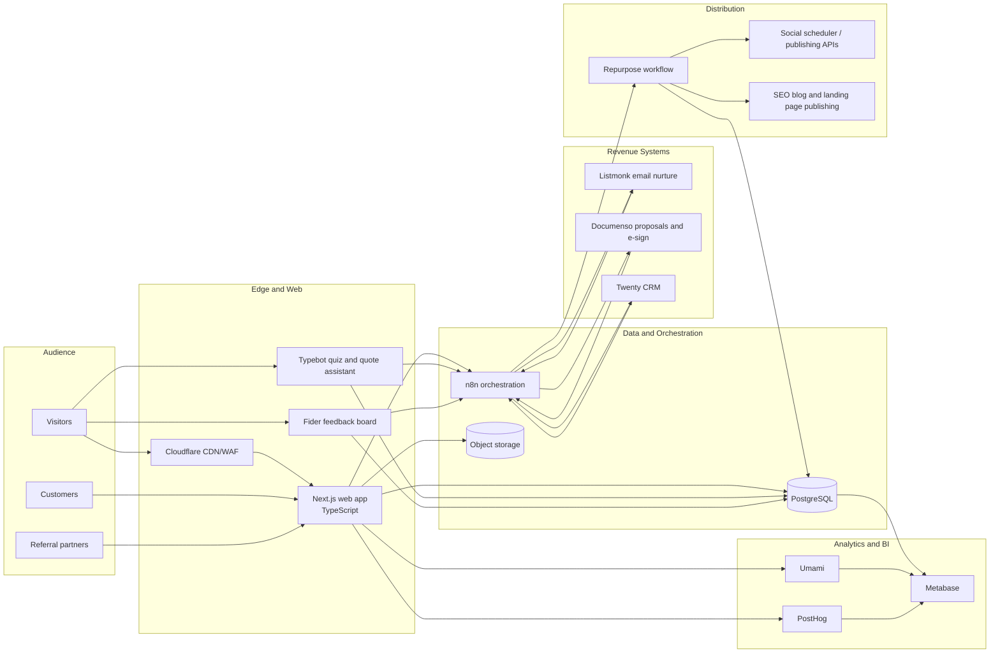

# Growth Ops Architecture Blueprint

Purpose: rebuild **charcuteriechick.ai** as a cinematic, SEO-first, high-conversion site with measurable acquisition, nurture, booking, review, and referral loops.

Cross-references:
- Data model: `data/sql/001_core_tables.sql`
- Attribution layer: `data/sql/002_attribution.sql`
- Automation specs: `services/automation/workflows/`
- Operating runbook: `docs/runbooks/ops-checklist.md`

## System scope

- **Public web app layer**: Next.js + TypeScript marketing site and quote funnel.
- **Data and event layer**: PostgreSQL source of truth for leads, sessions, events, bookings, reviews, and referrals.
- **Automation orchestration**: n8n for intake, enrichment, routing, nurture, post-booking follow-up, and content distribution.
- **Funnel systems**: Typebot, Listmonk, Documenso, and Twenty CRM.
- **Distribution layer**: content asset registry plus repurpose and publish workflows.
- **Analytics**: Umami for clean traffic, PostHog for product/funnel behavior, Metabase for operator reporting.
- **Feedback loop**: Fider for offer voting and market signal capture.

## Component diagram

## Component responsibilities

| Component | Role | Writes to | Reads from |
| --- | --- | --- | --- |
| Next.js web app | SEO pages, quote forms, schema, media galleries, referral landing pages | server-side `utm_sessions` and signed webhook payloads only | PostgreSQL, CMS/object storage |
| Typebot | Interactive quiz and pre-qualification | `leads`, `lead_events` via n8n | PostgreSQL |
| PostgreSQL | System of record | All core tables | N/A |
| n8n | Workflow execution, retries, dead-letter routing, enrichment | `lead_events`, `bookings`, `reviews`, `referrals`, `content_assets` | PostgreSQL, SaaS APIs |
| Listmonk | Email nurture and lifecycle segmentation | provider delivery events via n8n | lead segments, campaign audiences |
| Documenso | Proposal, contract, and signature milestones | booking and proposal status via n8n | lead and booking context |
| Twenty CRM | Pipeline, follow-up ownership, partner accounts | synced IDs into `leads` and `bookings` | lead and booking context |
| Umami | Topline acquisition analytics | summarized page/session stats | web events |
| PostHog | Funnel and UX behavior analytics | product analytics events | web events |
| Metabase | operator dashboards and attribution | derived views/materialized views | PostgreSQL, analytics exports |
| Fider | demand signal for offers and menu ideas | `lead_events`, idea metadata | lead identity when known |

## Canonical request and event flows

### 1. Organic visit -> quote submission

1. Visitor lands on an SSR service or city page rendered by Next.js.
2. Middleware captures UTM parameters, referrer, landing path, and a durable anonymous session key.
3. Web app writes a `utm_sessions` row and emits `session_started` to PostHog and Umami.
4. Visitor opens the quote form or Typebot assistant; the UI writes `quote_started`.
5. Submission hits a signed intake endpoint that forwards the payload to n8n; the browser never writes directly to lead tables.
6. n8n creates or upserts the `leads` row, writes `quote_submitted` to `lead_events`, syncs Twenty CRM, starts Listmonk nurture, and opens a quote SLA timer.

### 2. Quiz completion -> segmented nurture

1. Typebot collects event type, guest count, budget band, timeline, and email/SMS consent.
2. n8n normalizes the payload, upserts the lead, and records `quiz_completed`.
3. Lead is tagged into a segment such as `wedding_high_intent`, `corporate_lunch`, or `holiday_gifting`.
4. Listmonk receives the segment, sends the first nurture email, and returns delivery signals to n8n.

### 3. Quote -> proposal -> booking

1. Sales owner prepares pricing in CRM.
2. n8n generates a Documenso proposal packet and sends `proposal_sent`.
3. Signature, deposit, or manual confirmation writes `booking_confirmed` and updates `bookings.status`.
4. Booking events sync back into CRM and trigger reminders, prep tasks, and review timers.

### 4. Booking completion -> review -> referral

1. Fulfilled booking creates `booking_fulfilled`.
2. n8n sends review request sequences until `review_submitted` or timeout.
3. Positive reviews trigger referral invite, unique code generation, and `referral_shared`.
4. Referred sessions and bookings are linked through `referrals` and `utm_sessions` for revenue reporting.

### 5. Content flywheel

1. New gallery upload, testimonial, blog brief, or event recap is stored in `content_assets`.
2. n8n creates repurpose tasks for short-form scripts, social captions, email snippets, and internal links.
3. Approved assets are published across blog, reels, carousels, and email.
4. Performance metrics feed back into Metabase to prioritize topics and channels with the best booking yield.

### 6. Feedback loop

1. Fider collects votes on seasonal boards, offers, and event add-ons.
2. Vote metadata is written as `feedback_voted` events.
3. Weekly operator review compares votes, bookings, and lead quality to decide what to launch next.

## Data contracts and naming conventions

- Use snake_case table and column names across SQL, docs, and workflow payloads.
- Use event names exactly as stored in `lead_events.event_type` for lifecycle events persisted in PostgreSQL: `session_started`, `quote_started`, `quote_submitted`, `quiz_completed`, `proposal_sent`, `booking_confirmed`, `booking_fulfilled`, `review_requested`, `review_submitted`, `referral_shared`, `referral_converted`, and `content_published`.
- Keep workflow observability events such as `workflow_started`, `crm_sync_failed`, `publish_failed`, and `nurture_skipped_no_consent` in n8n logs, alerts, or an external telemetry sink; do not persist them into `lead_events.event_type` unless the enum is intentionally extended.
- Use dedicated foreign-system ID fields such as `crm_contact_id`, `external_crm_deal_id`, `external_documenso_id`, and `external_review_id` instead of overloading primary keys.
- Treat `utm_sessions.session_key` as the anonymous browser/session identity and `leads.id` as the known-person identity.

## Security and privacy controls

- Terminate TLS at Cloudflare and force HTTPS end to end.
- Use signed webhook secrets between web app, n8n, Listmonk, Documenso, and CRM.
- Restrict database writes to server-side app roles and workflow service roles; do not expose direct client write access beyond tightly scoped signed endpoints.
- Store only required PII: name, email, phone, event context, consent flags, and attribution metadata.
- Keep consent flags (`consent_email`, `consent_sms`) on the lead record and gate nurture sends on them.
- Encrypt secrets in the deployment platform; never store provider API keys in repo or workflow markdown.
- Apply retention rules: raw event payloads 13 months, marketing analytics 25 months, deal/revenue records 7 years or per finance policy.
- Mask or hash IP addresses before persistence if not required for fraud or geo reporting.
- Enable audit logs for admin actions in CRM, n8n, and Documenso.
- Maintain separate environments and datasets for production vs staging to avoid accidental outreach.

## Operational SLAs and SLOs

| Capability | Target | Alert threshold | Notes |
| --- | --- | --- | --- |
| Marketing site availability | 99.9% monthly | < 99.7% | Excludes scheduled content deploys under 15 minutes |
| Quote submission success | 99.5% per rolling 7 days | < 98.5% | Based on successful `quote_submitted` writes and workflow ACKs |
| n8n workflow latency | P95 < 120 seconds | P95 > 300 seconds | Trigger to terminal state for lead-facing automations |
| CRM sync success | 99% daily | < 97% | Measured by successful upsert ACKs |
| Email first-touch response | < 5 minutes median | > 15 minutes median | From quote submit to first nurture or confirmation send |
| Attribution freshness | < 60 minutes lag | > 180 minutes lag | Includes materialized view refresh |
| Metabase dashboard availability | 99.5% monthly | < 99.0% | BI is non-blocking but operationally important |

## Scaling plan

| Phase | Traffic / demand assumption | Delivery focus | Required upgrades |
| --- | --- | --- | --- |
| Phase 1: foundation | 0-10k sessions/month, 0-150 leads/month | Ship core SEO pages, quote capture, nurture, dashboards | Single Next.js deployment, one PostgreSQL instance, n8n queue mode optional, daily MV refresh |
| Phase 2: velocity | 10k-50k sessions/month, 150-750 leads/month | Add repurpose automation, referral loops, more landing pages, more segments | Separate worker for n8n, CDN image optimization, hourly MV refresh, CRM ownership rules, object storage lifecycle policies |
| Phase 3: compounding | 50k+ sessions/month, 750+ leads/month | Scale content ops, experimentation, partner channels, local SEO clusters | Read replicas or analytics replica, event stream/export pipeline, dedicated queue + DLQ, warehouse sync, concurrent materialized view refresh |

## Self-host vs SaaS decision matrix

| Tool | Role | Self-host fit | SaaS fit | Recommendation now |
| --- | --- | --- | --- | --- |
| PostgreSQL | Source of truth | Self-host if DB ops maturity and strict data residency exist | Managed PG for backups, patching, HA | **Managed PostgreSQL** |
| n8n | Workflow orchestration | Best when you need custom credentials, cost control, and reusable workers | Good for fast setup with lower ops load | **Self-host** |
| Typebot | Quiz funnel | Self-host if brand/domain control and lower variable cost matter | Great for speed and lower maintenance | **SaaS first** |
| Listmonk | Email nurture | Best for owned audiences, simple segmentation, low send cost | ESP marketing suite for deeper templates and support | **Self-host Listmonk + managed ESP** |
| Documenso | Proposal + e-sign | Self-host if contracts must stay in your infra | SaaS if signature reliability and legal ops speed matter | **SaaS first** |
| Twenty CRM | Pipeline tracking | Self-host if you need ownership of pipeline data and custom objects | SaaS if sales ops bandwidth is low | **SaaS first, self-host later** |
| Umami | Privacy-first analytics | Strong self-host option with low ops burden | SaaS if you want zero maintenance | **Self-host** |
| PostHog | Funnel analytics and experiments | Self-host if event volume or governance justifies it | SaaS for the fastest instrumentation and experimentation rollout | **SaaS first** |
| Metabase | BI dashboards | Self-host if analysts need unrestricted SQL access | SaaS for simpler upgrades and alerting | **Self-host** |
| Fider | Offer voting loop | Easy to self-host and embed into growth ops | SaaS if moderation/admin time is constrained | **Self-host** |

## Implementation notes

- Start with server-rendered service pages, city pages, quiz page, quote page, gallery, and referral landing page templates.
- Build webhooks once and keep all external-system branching inside n8n to reduce app complexity.
- Use Metabase dashboards on top of the attribution views before introducing a separate warehouse.
- Gate new channels with a `content_assets` record so every publish action is attributable.
- Treat workflow markdown specs as the contract for n8n implementation and QA.
